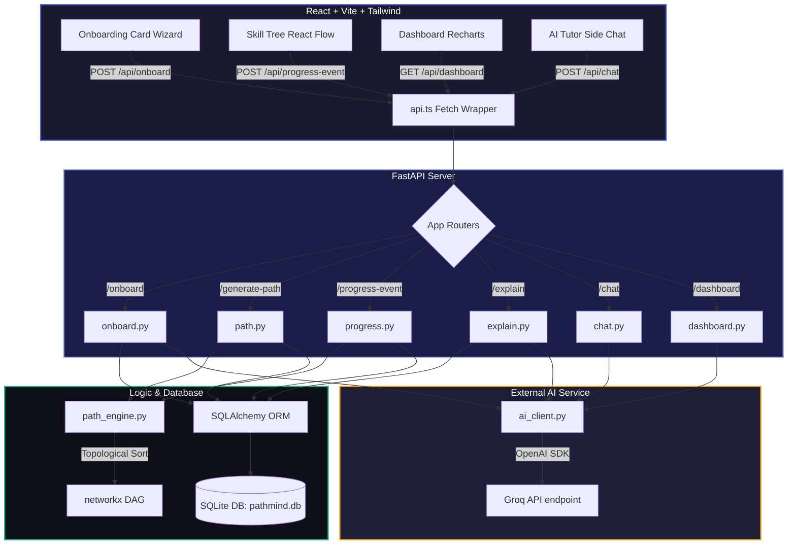

# PathMind 🧠⚡ — AI-Powered Personalized Learning Path Recommender

> **The learner isn't just given a course list — they get an interactive, live skill graph that re-plans itself dynamically based on real-time feedback.**

PathMind models all skills as a **prerequisite knowledge graph (DAG)**, uses the **Groq API** to convert your free-text goals into target skills, scores diagnostic quizzes, provides explanations grounded in the graph edges, and presents a beautiful **interactive RPG-style skill tree** with smooth layouts.

---

## 🏗️ System Architecture

The following diagram illustrates how the frontend components, FastAPI routers, database models, and Groq LLM coordinate to compute, render, and adapt the personalized learning roadmap:



---

## ✨ Key Features

| Feature | Description |
|---|---|
| 🗺️ **DAG-based Path Engine** | 28-node Data Scientist prerequisite graph powered by `networkx`. |
| ⚡ **Groq LLM Integration** | Goals extraction, adaptive quiz scoring, grounded explanations, and tutor chat using Groq's high-speed API. |
| 🎮 **RPG-style Skill Tree** | Symmetrical React Flow graph showing locked, unlocked, in-progress, and completed skills. |
| 🔄 **Adaptive Re-planning** | **Fail Checkpoint:** Lowers confidence and inserts remedial nodes. <br>**Skip Node:** Marks skill as complete and prunes downstream redundancies. |
| 💬 **Grounded Explainability** | Every AI explanation cites the exact prerequisite graph relationships to avoid hallucinated suggestions. |
| 📊 **Progress Dashboard** | Recharts radar charts of your skill categories, streaks, XP scores, badges, and an AI-generated weekly study plan. |

---

## 🚀 Quick Start

### Prerequisites
- Python 3.10+
- Node.js 18+
- A Groq API key from [console.groq.com](https://console.groq.com)

### 1. Run/Start the Backend

```bash
cd backend

# Install dependencies
pip install -r requirements.txt

# Configure your Groq API key in your environment file:
# Write 'GROK_API_KEY=gsk_yourKey' inside backend/.env

# Run development server (auto-seeds the SQLite DB on startup)
uvicorn main:app --reload
```
The backend API documentation is available at **http://localhost:8000/docs**

### 2. Run/Start the Frontend

```bash
cd frontend

# Install dependencies
npm install

# Run the local Vite dev server
npm run dev
```
The frontend is available at **http://localhost:5173**

---

## 🎬 Walkthrough Demo Script

1. **Open** http://localhost:5173
2. **Complete the Card Wizard**:
   * Step 1: Input your name.
   * Step 2: Set your goal (e.g., *"I want to be a data scientist in 6 months. I know basic python."*).
   * Step 3: Select your experience level.
   * Step 4: Answer the diagnostic questions to calibrate your roadmap.
3. **Explore the Skill Tree**:
   * Inspect the vertical flow showing nodes mapped to their topological depth.
   * Click a node to view the side panel with resource links, status actions, and **"Ask AI to Explain"**.
4. **Trigger Adaptivity**:
   * Mark a node as **Skipped** to watch the engine prune redundant prerequisites.
   * Mark a node as **Started** and click **Failed Checkpoint** to see the path insert remedial material.
5. **View Dashboard**:
   * Review your radar skill categories, badges, and your dynamic AI study plan.

---

## ⚙️ How the Graph Layout Engine Works

PathMind generates coordinates horizontally and vertically so that nodes never overlap:
1. **DAG Depth Sorting:** Calculates a node's topological depth in the DAG:
   $$\text{depth}(u) = 1 + \max_{v \in \text{prereqs}(u)} \text{depth}(v)$$
2. **Horizontal Grouping:** Group nodes with the same depth.
3. **Centered Alignment:** Spreads nodes at depth $d$ symmetrically across the X-axis:
   $$x_i = \left(i - \frac{N_d - 1}{2}\right) \times \text{colWidth}$$
4. **Smooth Curves:** Uses React Flow's `smoothstep` edges colored dynamically based on relation status.

---

## 🔒 Security Configuration

To keep credentials secure, `.gitignore` is pre-configured to block pushing variables and local data to GitHub:
- `backend/.env` (contains your `GROK_API_KEY`)
- `backend/pathmind.db` (local SQLite database file)
- `frontend/node_modules/` (dependencies folder)
- `frontend/dist/` (build directory)